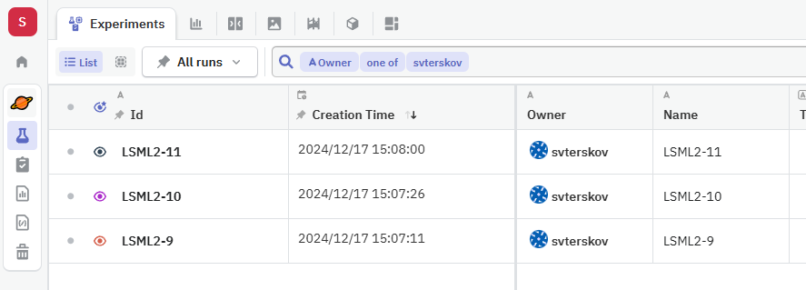
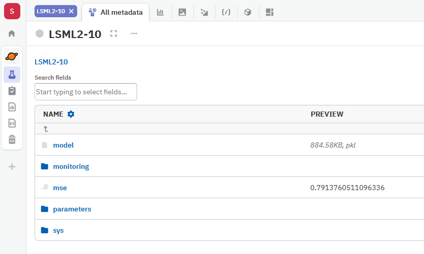
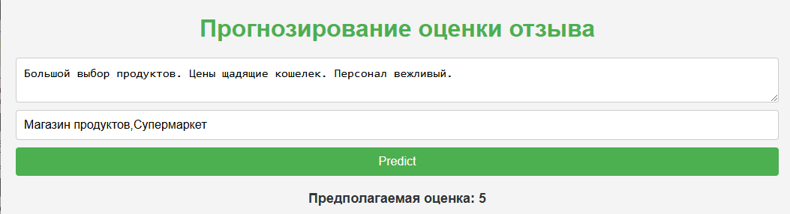
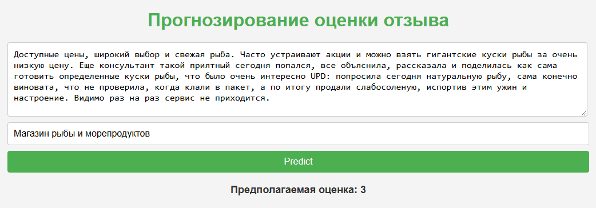
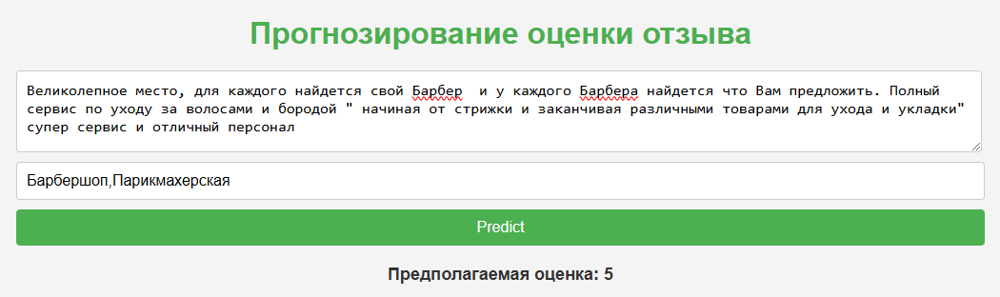
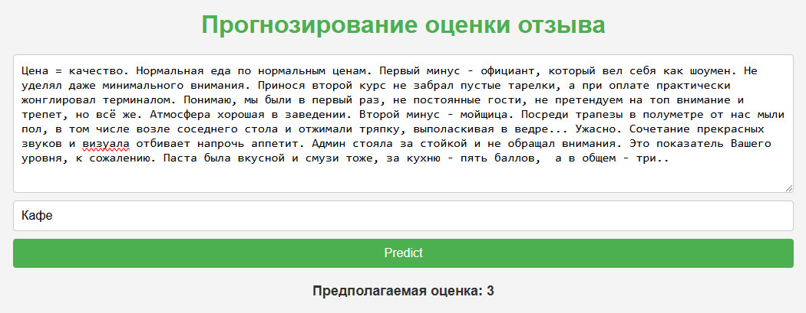

# Финальный проект курса LSML2
Студент: Терсков Сергей

# Описание проекта
Разработка ИИ-сервиса для опрогнозирования рейтинга отзыва пользователя на основе текста пользователя и тегов (рубрик).  Проект включает разработку и обучение ИИ-модели на основе открытого датасета отзывов. Geo Reviews Dataset 2023 - крупнейший русскоязычный датасет отзывов об организациях, опубликованных на Яндекс Картах ([github.com/yandex/geo-reviews-dataset-2023](https://github.com/yandex/geo-reviews-dataset-2023))

# Обучение модели
ИИ-модель обучена с использованием фреймворка XGBoost ([xgboost.ai](https://xgboost.ai/)). Процесс обучения модели представлен в файле [create_model.ipynb](create_model.ipynb) (Jupyter notebook).

Для выбора модели с лучшими характеристиками использован сервис [Neptune.ai](https://neptune.ai/).

В качестве метрики применялась MSE.

Для сервиса выбрана модель с лучшей метрикой.


# Создание сервиса
Сервис представлен как сервер для представления API модели (приложение Flask). Интерфейс - веб-страница для ввода текста отзыва и рубрик, взаимодействующая с API с помощью JavaScript.

## Файл [model.py](service/app/model.py)
```python
# app/model.py
import joblib
import pandas as pd
from sklearn.preprocessing import MultiLabelBinarizer
from sklearn.feature_extraction.text import TfidfVectorizer

class Model:
    def __init__(self):
        self.model = joblib.load('xgb_model.pkl')
        self.vectorizer = joblib.load('vectorizer.pkl')
        self.mlb = joblib.load('mlb.pkl')

    def predict(self, text, rubrics):
        rubrics_vector = self.mlb.transform([rubrics])[0]
        text_vector = self.vectorizer.transform([text]).toarray()[0]
        input_vector = list(text_vector) + list(rubrics_vector)
        return self.model.predict([input_vector])[0]

```

## Файл [app.py](service/app/app.py)
```python
# app/app.py
from flask import Flask, request, render_template, jsonify
from model import Model

app = Flask(__name__)
model = Model()

@app.route('/')
def index():
    return render_template('index.html')

@app.route('/predict', methods=['POST'])
def predict():
    data = request.json
    text = data['text']
    rubrics = data['rubrics']
    prediction = round(model.predict(text, rubrics))
    
    return jsonify({'prediction': prediction})

if __name__ == '__main__':
    app.run(host='0.0.0.0', port=5000)
```

## Файл [index.html](service/app/templates/index.html)
```html
<head>
    <meta charset="UTF-8">
    <meta name="viewport" content="width=device-width, initial-scale=1.0">
    <title>Прогнозирование оценки отзыва</title>

	<style>
		* {
			margin: 0;
			padding: 0;
			box-sizing: border-box;
		}

		body {
			font-family: Arial, sans-serif;
			background-color: #f4f4f4;
			color: #333;
			padding: 20px;
		}

		h1 {
			text-align: center;
			margin-bottom: 20px;
			color: #4CAF50;
		}

		textarea {
			width: 100%;
			padding: 10px;
			border: 1px solid #ccc;
			border-radius: 4px;
			font-size: 16px;
		}

		input[type="text"] {
			width: 100%;
			padding: 10px;
			margin-top: 10px;
			border: 1px solid #ccc;
			border-radius: 4px;
			font-size: 16px;
		}

		button {
			background-color: #4CAF50;
			color: white;
			padding: 10px 15px;
			border: none;
			border-radius: 4px;
			cursor: pointer;
			font-size: 16px;
			margin-top: 10px;
			width: 100%;
		}

		button:hover {
			background-color: #45a049;
		}

		#result {
			margin-top: 20px;
			font-size: 18px;
			font-weight: bold;
			text-align: center;
		}
	</style>
    <script>
        async function getPrediction() {
            const text = document.getElementById('text').value;
            const rubrics = document.getElementById('rubrics').value.split(',');
            const response = await fetch('/predict', {
                method: 'POST',
                headers: {
                    'Content-Type': 'application/json'
                },
                body: JSON.stringify({ text, rubrics })
            });
            const data = await response.json();
            document.getElementById('result').innerText = 'Предполагаемая оценка: ' + data.prediction;
        }
    </script>
</head>
<body>
    <h1>Прогнозирование оценки отзыва</h1>
    <textarea id="text" placeholder="Текст отзыва"></textarea>
    <input type="text" id="rubrics" placeholder="Рубрики (разделённые запятой)">
    <button onclick="getPrediction()">Predict</button>
    <div id="result"></div>
</body>
</html>
```

# Сборка приложения
Для сборки использован Docker Compose. 

## Файл сборки [docker-compose.yml](service/docker-compose.yml)
```yaml
services:
  ml_service:
    build:
      context: ./app
    ports:
      - "5000:5000"
    volumes:
      - ./app:/app
```

# Файл для docker-образа [Dockerfile](service/app/Dockerfile)
```
# app/Dockerfile
FROM python:3.9-slim

WORKDIR /app

COPY requirements.txt .
RUN pip install --no-cache-dir -r requirements.txt

COPY . .

CMD ["python", "app.py"]
```

# Пример работы
После сборки и запуска приложение доступно по адресу [127.0.0.1:5000](http://127.0.0.1:5000/)

Примеры прогнозирования оценок:
- 
- 
- 
- 
